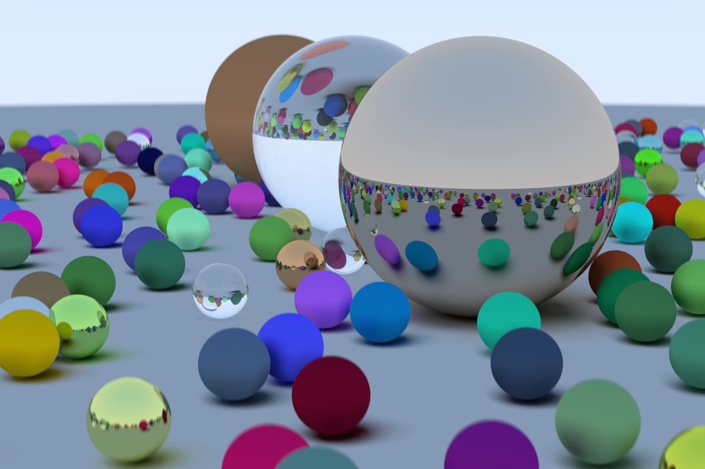

# RayTracer

Implementation of a small ray tracing renderer according to the tutorial in https://raytracing.github.io/books/RayTracingInOneWeekend.html.
* Compiles under gcc 9.4.0 Ubuntu 20.04 
* Compiles under MSVC Windows 10.

## building
* `<source directory>` is the root directory of this repo which contains `CMakeLists.txt`.
* `<build directory>` is the target directory for build files. It doesn't have to be created in advance.
* commands:
  1. `cmake -S <source directory> -B <build directory>`
  2. `cmake --build <build directory>`

## Notes
* Complexity is mainly controlled in `main.cpp` by `image_width` and `samples_per_pixel`.
* Rendered scene can be changed by adding creation functions to `scene.h` and feeding their output `hittable_list` to `world` also in `main.cpp`.

## Example result

#^ two spaces